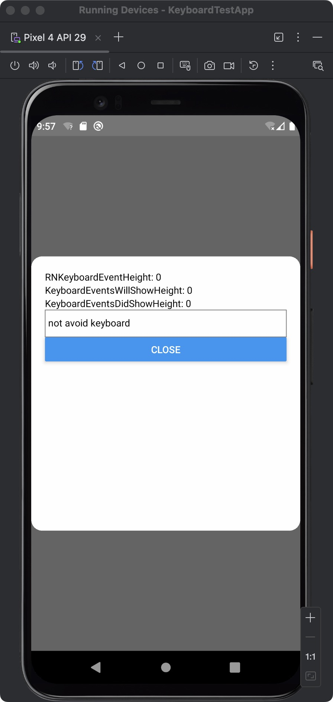
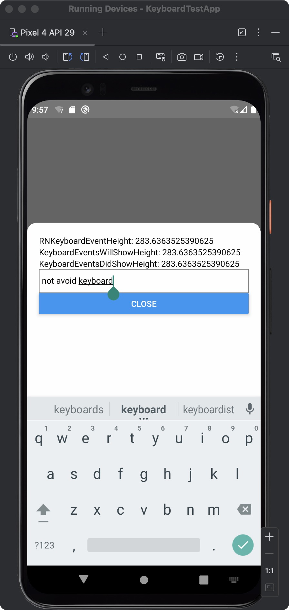

# React Native Keyboard Controller Issues - Minimal Reproduction

This repository contains a minimal reproduction of issues with `react-native-keyboard-controller` library.

## Issues Reproduced

### 1. KeyboardEvents Behavior with Different windowSoftInputMode Settings

**Problem**: When `android:windowSoftInputMode` is set to `adjustPan`, `KeyboardEvents` only triggers once instead of properly tracking keyboard show/hide events.

**Expected**: `KeyboardEvents` should work consistently regardless of `windowSoftInputMode` setting.

**Current Behavior**:
- `adjustResize`: ✅ `KeyboardEvents` works correctly
- `adjustPan`: ❌ `KeyboardEvents` only triggers once

### 2. KeyboardAvoidingView Not Working with Modalfy Modals

**Problem**: When `KeyboardAvoidingView` wraps a `react-native-modalfy` modal, it doesn't work properly.

**Expected**: `KeyboardAvoidingView` should work consistently whether wrapping normal components or modals.

**Current Behavior**:
- Normal components: ✅ `KeyboardAvoidingView` works correctly
- Modalfy modals: ❌ `KeyboardAvoidingView` doesn't work

## Screenshots

### Modal fully visible (keyboard hidden)


### Modal covered by keyboard (KeyboardAvoidingView not working)


## Setup

1. Clone this repository
2. Install dependencies:
   ```bash
   npm install
   ```
3. Run on Android:
   ```bash
   npm run android
   ```

## Test Instructions
1. **Test Issue 1**: 
   - Open the app and tap "Open Modal"
   - Focus the text input in the modal
   - Observe that keyboard events are tracked correctly with `adjustResize`
   - Change `android:windowSoftInputMode` to `adjustPan` in `android/app/src/main/AndroidManifest.xml`
   - Rebuild and test again - notice `KeyboardEvents` only triggers once
2. **Test Issue 2**
   - Open the modal and focus the text input
   - Notice that the `KeyboardAvoidingView` doesn't properly adjust the layout
   - The input field gets covered by the keyboard instead of being pushed up

## Environment

- React Native: 0.78.0
- react-native-keyboard-controller: 1.17.5
- react-native-modalfy: 3.6.0
- react-native-reanimated: 3.17.5
- Android API: 29 (Android 10)

## Files Modified

- `App.tsx`: Main test application
- `android/app/src/main/AndroidManifest.xml`: Contains `android:windowSoftInputMode="adjustResize"`

## Related Issues

- GitHub Issue #1019: https://github.com/kirillzyusko/react-native-keyboard-controller/issues/1019

## Reproduction Steps
1. The app shows three keyboard height values:
   - `RNKeyboardEventHeight`: Native React Native keyboard events
   - `KeyboardEventsWillShowHeight`: react-native-keyboard-controller willShow events
   - `KeyboardEventsDidShowHeight`: react-native-keyboard-controller didShow events
2. When keyboard appears, these values should update to show the keyboard height
3. With `adjustPan`, only the first event triggers, subsequent events don't fire
4. The modal's `KeyboardAvoidingView` doesn't work properly, leaving the input field covered by the keyboard
